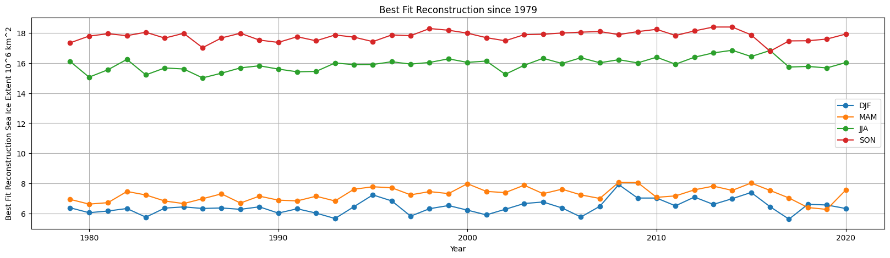

## Projecting the Future of Antarctica Sea Ice Using Reconstructed Data and ARIMA

I applied machine learning techniques to investigate the extent of Antarctica's sea ice for the next five years.

***

## Introduction 

Antarctica sea ice is characterized by unpredictability. Unlike Arctic sea ice, Antarctic sea ice has not followed a trend that most scientists and the public would expect. While Arctic sea ice has decreased steadily due to increasing global temperatures, the opposite was occurring in the south. Since the satellite era, Antarctica's sea ice has steadily increased until the 2015/2016 season, when the sea ice extent reached what was then the record low. Just before that season, Antarctica's sea ice reached its maximum extent ever recorded in 2014, further suggesting the unpredictability of sea ice. Ever since the decrease in the 2015/2016 season, Antarctica's sea ice has continued to decrease on average. Antarctica follows a seasonal pattern with September being the maximum and February being the minimum. In September of 2023, Antarctica's sea ice reached the lowest maximum ever recorded. While rising temperatures play a role, Antarctic sea ice is complicated in nature. Due to the complicated interactions between atmospheric and oceanic phenomena, locally and globally, the past and future of Antarctica's sea ice is difficult to predict. Additionally, sea ice extent and behavior for each season greatly vary between the 5 main geographical regions. This was the case until recently published reconstructed Antarctic sea ice data (Fogt et al. 2022). 

Recently, reconstructed Antarctic sea ice data has accurately modeled the increase and decrease recorded in the observation data, which is a problem continually missed by climate models (Fogt et al. 2023). Using this reconstruction data set, I followed a machine learning approach to model the future of the Antarctic sea ice extent. I used an ARIMA (autoregressive integrated moving average model approach) to solve the problem. A similar study was conducted using ERA5 reanalysis data of sea ice concentration in the Arctic. An ARIMA model was used to improve forecasting Arctic sea ice for shipping transportation purposes (Wu et al. 2023). Wu et al. were able to verify the validity of their model with CMIP5 data due to a more predictable trend that was observed in the Arctic. The inaccuracies in climate models and the unpredictability in observed Antarctica sea ice prove it difficult to confirm the predictions from this project. However, following a similar approach and a similar short-term time frame, I conclude that the Antarctic sea ice extent for the next five years will continue to follow the current decreasing trend recorded in the past few years.

## Data

The primary data set for this project is from NSIDC Seasonal Antarctic Sea Ice Extent Reconstructions developed by Ryan Fogt et al. The data is reconstructed from 1905 to 2020 using observed temperature, the Interdecadal Pacific Oscillation, the Atlantic Multidecadal Oscillation, the Pacific Decadal Oscillation, the Southern Oscillation index, the Southern Annular Mode, and the Nino indexes. The reconstruction data sets are calibrated to satellite-era observations. The best-fit reconstructed data is used which is the highest performing ensemble member out of 24 ensemble members. The reconstructed data is available for the entire Antarctic sea ice extent and the five geographic regions (Amundsen-Bellingshausen Seas, Weddell Sea, King Hakon VII, East Antarctica, and Ross-Amundsen Sea); however, the entire Antarctica is focused on this project from 1979 to 2020. 

A new dataset is combined to include all the seasonal sea ice extent for each year as this was seasonal reconstruction data. As a result, a new file from 1979 to 2020 is created with four points with data for each season. Figure 1 shows the plotted seasonally reconstructed data from  DJF (December, January, February), MAM (March, April, May), JJA (June, July, August), and SON (September, October, November). Autoregression would not be accurate and reliable with only four data points representing each year. The data was interpolated with 500 points to provide more data for the autoregression (Figure 2). Additionally, a new data set is created with 411 points for reconstructed sea ice extent and years from 1979 to 2020 in intervals of 0.1 years.
  


{: width="1500" }
*Figure 1: This is the best-fit for four seasons reconstructed from 1979-2020.*


{: width="2000" }
*Figure 2: The interpolated data of sea ice extent using 500 points.*

## Modelling

ARIMA model is chosen for this project as it is a widely used and suitable statistical method for forecasting time series data. The model ran twice with two sets of data: 1) The transformed sea ice difference (Taking the difference between consecutive elements to remove seasonality and trends) and 2) The original best-fit reconstruction data. 

**1) ADF**

In addition, the data sets were checked for the presence of unit roots and stationarity using the ADF (Augmented Dickey-Fuller) test before undergoing the ARIMA model. The ADF test checks whether the data set has stationarity by providing the ADF value, P-value, number of lags, number of observations used for the SDF regression, and critical values calculation, the critical values which are displayed in 1%, 5%, and 10%.  The results of the ADF test for the first data set likely indicate there is stationarity in the data with the negative ADF value and the statistically small P-value (cite chart). The results for the second data set did not indicate stationarity as the ADF value is higher than critical values and the P-value is relatively high (cite table 2). Non-stationarity in the ARIMA model can impact results, which will be discussed in the conclusion section.

```python
from statsmodels.tsa.stattools import adfuller
def ad_test(dataset):
    dftest_diff =adfuller(dataset, autolag = 'AIC')
    print("1. ADF:", dftest_diff[0])
    print("2. P-Value:", dftest_diff[1])
    print("3. Num of Lags:", dftest_diff[2])
    print("4. Num of Oberservations used for ADF regression and critical values calculation:", dftest_diff[3])
    print("5. Critical Values:")
    for key_diff, val_diff in dftest_diff[4].items():
        print("\t",key_diff,":", val_diff)
```

| Categories | Values    |
| :-----: | :---: |
| ADF | -5.94   |
| P-Value | 2.25e-07   |
| Num of Lags | 17   |
| Num of Obs | 392   |
| Critical Values | 1% : -3.45
5% : -2.87
10% : -2.57   |
*Table 1: Results of the ADF tests for the difference in sea ice (left) and sea ice extent (right)*

**2) Auto Arima and Training**

The data is put into ‘auto_arima’ to choose the optimal parameters for the ARIMA model (p,d,q) to minimize the AIC 

```python
from pmdarima import auto_arima
import warnings
warnings.filterwarnings("ignore")
stepwise_fit = auto_arima(recon_diff.values,trace=True,
                          suppress_warnings=True)
stepwise_fit.summary()
```
To find the optimal parameters for the ARIMA model, the AIC metric (Akaike Information Criterion) is used in model selection. A lower AIC value indicates a better fit for the data. The AIC value for the first data set is 574.214 and 194.754 in the second data set. The summary indicated that the optimal parameters (p,d,q) for the first data set is (2,0,1); however, through multiple runs and tests, the more suitable (p,d,q) for the first data set is (5,0,3). The second (p,d,q) resulted in a better and more accurate fit. The (p,d,q) for the second data set is (2,0,2). Ten percent of the 500 points were split to be the testing set. The training set has 369 points and the testing set has 41 points. The training set is not randomized and is the last 41 points of the data set, spanning from 2016 to 2020. The testing set spans from 1979 to 2016. Predictions were made by inputting the testing sets in the ARIMA model using the (p,d,q), for the respective data sets. The first data set projected similar results in the 2016 cycle but began an upward shift compared to the testing set (Figure 3). The second data set had slight overfitting up until 2017 and underfitting beginning in 2018 (Figure 3). Overall, both models performed well with an RMSE (root squared mean error) of 0.57267 for the first data set and 0.80034 for the second data set. 

{: width="500" } 
{: width="500" }
*Figure 3: The predicted compared to the testing sets of the difference in sea ice (top) and sea ice extent (bottom).*

## Results and Discussion

The ARIMA models were used to predict the future trend of Antarctic sea ice using the same optimal parameters (p,d,q). 50 data points were chosen to generate future years for prediction which is approximately 5 years. The predictions for both sets follow the same seasonality as current Antarctic sea ice trends (Figure 4) 

{: width="1200" } 
{: width="1200" }
*Figure 4: The predictions of the difference (top) and the sea ice extent (bottom) from the ARIMA model*

The predictions for the first data set continue to follow a similar trend of the sea ice seasonal cycles. The peak difference and minimum difference stay within the range with no notable changes to sea ice. It is important to note that the first data set is shifted to the left as the difference in sea ice is taken. This moves the array position as the consecutive values are subtracted. 

In contrast, the prediction made using the second data set shows a more noticeable trend. While the predicted sea ice for the next five years continues to follow the seasonal trend of Antarctic sea ice currently, the cycle seems to decrease in size. The minimum sea ice extent and the maximum sea ice extent decrease with time. The 2021 sea ice annual cycle predicted a maximum of 18.78 million square kilometers to a minimum of 4.75 million square kilometers. However, the prediction for the 2024 sea ice cycle predicted a maximum of 17.74 million square kilometers and a minimum of 5.8 million square kilometers. This shows a decrease in maximum sea ice and an increase in minimum sea ice extent towards the end of the prediction period. The graph coincides with a damping effect, similar to an oscillating system losing energy. Extending the prediction period to 10 years or 20 years would likely see an extreme scenario of the damping effect. While this is a prediction, likely, real-life Antarctic sea ice would not see this effect. The first data set shows a more likely scenario, which is a slight decrease in overall sea ice. 

There are a couple of limitations to this project which could have likely influenced the predictions from the ARIMA model. As the original data set had only four data points, interpolation is performed to create more points for the ARIMA model. When the data is interpolated, it is important to note the overshooting and undershooting of the sea ice's maximum and minimum extent. Using the cubic method, the interpolation could have overestimated and underestimated the sea ice extent for several years, which would impact the prediction for the next five years. However, it is still important to note that although interpolation was done, the overall trend is still apparent. A slight increase leading up to a noticeable decrease after 2016. To improve the accuracy of the interpolation or to eliminate the use of interpolation, monthly reconstructed sea ice data would be more suitable. 

Additionally, the ARIMA model prediction for the second data set could have been affected by the non-stationarity of the data set. As the second data set was just the best-fit model for the reconstructed data, it was not transformed or normalized. This most likely resulted in a damping effect on the graph due to the seasonal and yearly trends. While ARIMA modes do not incorporate damping effects, the time series could have represented a physical phenomenon similar to damping effects, therefore influencing the predicted data. Furthermore, the unpredictable and drastic decrease in sea ice extent from 2014 to 2016 has shown the short-term fluctuations that can occur in the Southern Ocean, which has limited the project to predict on short time scales and in this case, only the next 5 years. 

## Conclusion

ARIMA model is a useful tool in predicting and forecasting a time series. For non-stationarity data, it would improve the model’s output after normalizing and transforming; however, the predictions for this project are also affected by the unpredictability of Antarctic sea ice. While results do continue to indicate a seasonal trend, additional information is needed to improve the accuracy of the model. Additionally, the yearly Antarctic sea ice extent depends greatly on that season’s atmospheric and oceanic behaviors. To improve the accuracy for future scenarios, projected temperatures, and climate indices could be included. Furthermore, an analysis of each of the 5 regions can provide further insight into the regional behavior of Antarctic sea ice, potentially explaining the recent trends observed. However, the ARIMA model still provides great insight into the difference in Antarctic seasonal cycles and general trend, which is a continual decrease in sea ice extent. 

## References

[1] Fogt, R., M. N. Raphael, and M. S. Handcock. (2023). Seasonal Antarctic Sea Ice Extent Reconstructions, 1905-2020, Version 1 [Data Set]. Boulder, Colorado USA. National Snow and Ice Data Center. https://doi.org/10.7265/55x7-we68. 

[2] Fogt, R.L., Sleinkofer, A.M., Raphael, M.N. et al. A regime shift in seasonal total Antarctic sea ice extent in the twentieth century. Nat. Clim. Chang. 12, 54–62 (2022). https://doi.org/10.1038/s41558-021-01254-9

[3] Wu D, Tian W, Lang X, Mao W, Zhang J. Statistical Modeling of Arctic Sea Ice Concentrations for Northern Sea Route Shipping. Applied Sciences. 2023; 13(7):4374. 

[back](./)

